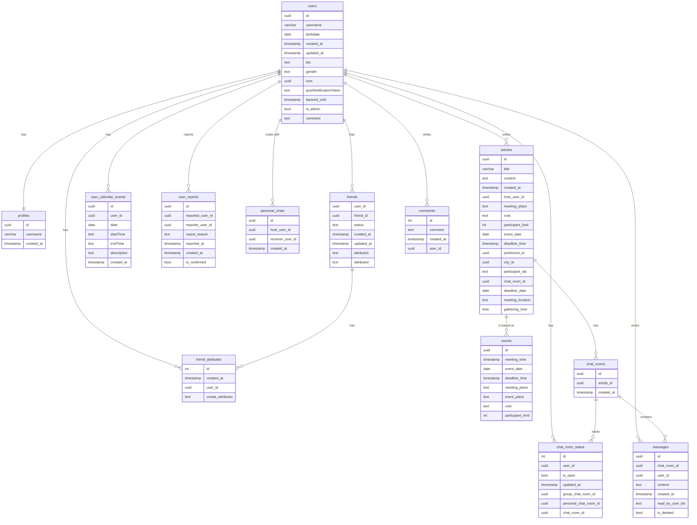
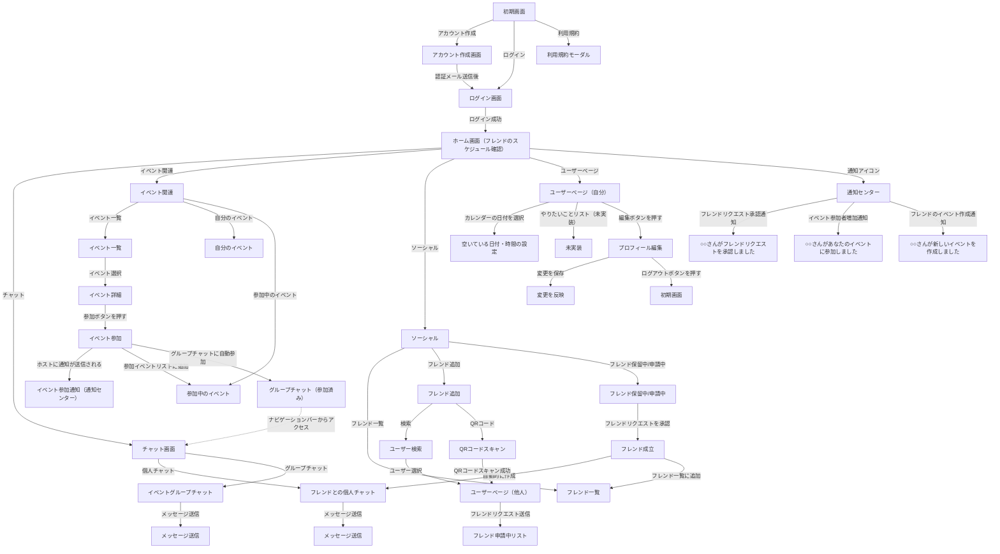

# 

## 🎯 企画の背景と問題

私たちは、**自分から遊びに誘うのが苦手な人でも、気軽に友達を誘えるアプリ**を作りたいと考えました。

学生時代や職場など、同じ環境にいる時は仲の良かった友達でも、進学・就職・転職などのライフイベントによって関係が疎遠になってしまうことがあります。  
実際に、**喧嘩別れなどではないのに疎遠になってしまった友人がいる**と答えた人の割合は、800人中86.8%と非常に高い結果が出ています。

では、なぜ「また会いたい」と思っていても、連絡を取らずに疎遠になってしまうのでしょうか？

その理由の一つとして、**遊びに誘うことへの心理的ハードル**があると私たちは考えました。

「自分から友達を誘うのが苦手」と感じている人は約52％。  
その主な理由としては以下のような声がありました：

- 誘うための文章を考えるのが苦手  
- 断られたときに気まずくなるのが嫌  
- 忙しそうな相手に気を遣ってしまう

このような心理的な負担によって、「疎遠になってしまった友達」には特に声をかけづらく、結果として関係が自然に途切れてしまいます。

私たちは、そういった人でも気軽に遊びに誘えるような仕組みを提供し、**再び人と人のつながりを広げること**を目指しています。

---

## 🧩 扱う問題と解決方法

### ❗ 扱う問題
誘いたい気持ちはあるのに、「自分から誘うのが苦手」と感じている人は多くいます。  
その理由としては

- 誘うための文章を考えるのが苦手  
- 断られたら気まずい  
- 忙しそうな相手に気を遣ってしまう

こうした小さな心理的な負担が積み重なり、友人関係の自然な疎遠化へとつながってしまいます。

---

### 💡 解決方法として考えたこと
こうした問題を解決するために、私たちは以下のような機能を考えました。

- **投稿形式での誘い方**  
　→ 個別にメッセージを送るのではなく、誘いたい友達に向けて投稿形式でイベントを作成

- **暇な日カレンダー**  
　→ 相手の空いている日が事前にわかるため、断られる心配が減る

- **やりたいことリスト**  
　→ 「何するか決まってないから誘いづらい…」という状態でも、あらかじめやりたいことを共有できる

これらの機能を通じて、遊びに誘う心理的ハードルを下げ、関係をつなぎ直すきっかけを提供します。

## 🛠️ 使用技術

### 🏗️ フレームワーク  

### 🖥️ サーバー  

### 💻 言語  

### 🧰 開発ツール  

---

## 🧭 スキーマ図

---

## 📱 画面遷移図

---

## 📱💻 アプリ画面一覧（スマホ / Web）

### 🚪 ウェルカム画面

アプリ起動時の最初の画面。ログイン・アカウント作成・利用規約に進む。

- ログインボタン → ログイン画面へ  
- アカウント作成ボタン → アカウント作成画面へ  
- 利用規約 → 閲覧のみ可能（モーダル）

<table>
  <tr>
    <th>📱 スマホ画面</th>
    <th>🖥 Web画面</th>
  </tr>
  <tr>
    <td></td>
    <td></td>
  </tr>
</table>

---

### 📝 アカウント作成画面

新規登録用画面。

- ユーザー名、メールアドレス、生年月日、パスワード入力  
- 利用規約の同意が必須  
- アカウント作成 → 認証メール送信  

<table>
  <tr>
    <th>📱 スマホ画面</th>
    <th>🖥 Web画面</th>
  </tr>
  <tr>
    <td></td>
    <td></td>
  </tr>
</table>

---

### 🔐 ログイン画面

既存ユーザーのログイン用。

- メールアドレス・パスワード入力  
- ログインボタンでホームへ遷移  
- アカウント未作成の場合は作成画面へ

<table>
  <tr>
    <th>📱 スマホ画面</th>
    <th>🖥 Web画面</th>
  </tr>
  <tr>
    <td></td>
    <td></td>
  </tr>
</table>

---

### 🏠 ホーム画面（フレンドのスケジュール確認） ※スマホのみ

- カレンダーでフレンドの空いている日付を一覧表示  
- 色がついている日付をタップすると空き時間を表示

| カレンダー一覧 | → | 日付選択後の空き時間表示 |
|----------------|----|----------------------------|
|  |   |

---

### 👥 ソーシャル画面（タブ形式）

#### フレンド一覧タブ

- フレンドの一覧表示  
- 各ユーザーをタップ → 属性割り当てモーダルへ  

<table>
  <tr>
    <th>📱 スマホ画面</th>
    <th>🖥 Web画面</th>
  </tr>
  <tr>
    <td></td>
    <td></td>
  </tr>
</table>

#### フレンド追加タブ

- QRコード or ユーザー検索でフレンド申請  ※QRコードはスマホのみ

<table>
  <tr>
    <th>📱 スマホ画面</th>
  </tr>
  <tr>
    <td></td>
  </tr>
</table>

#### 📷 QRコード表示モーダル

- 自分のプロフィールページQRコードを表示  
- 相手が読み取ることで申請可能  

#### 🔍 ユーザー検索

- 入力欄からリクエストを送信したいユーザー名を入力
- 表示されたユーザーを選択することでユーザーページ（他ユーザー）に遷移
  
| QRコード表示モーダル |              | ユーザー検索（スマホ） | ユーザー検索（Web） |
|----------------------|--------------|------------------------|---------------------|
|  |              |  |  |

---

### 👤 ユーザーページ（他ユーザー）

- アイコン・名前・自己紹介など表示  
- フレンド申請、削除、報告ボタンを設置  
- メッセージボタン（フレンド成立時のみ）あり  

<table>
  <tr>
    <th>📱 スマホ画面</th>
    <th>🖥 Web画面</th>
  </tr>
  <tr>
    <td></td>
    <td></td>
  </tr>
</table>

---

#### フレンド保留中・申請中タブ

- 保留中：自分宛に届いたリクエストを承認 / 拒否  
- 申請中：自分がフレンド申請したユーザーの一覧  

<table>
  <tr>
    <th>📱 スマホ画面</th>
    <th>🖥 Web画面</th>
  </tr>
  <tr>
    <td></td>
    <td></td>
  </tr>
</table>

---

### 🏷️ 属性割り当てモーダル

- フレンドに属性を割り当てるモーダル  
- チェックで選択 → 保存で反映  

<table>
  <tr>
    <th>📱 スマホ画面</th>
    <th>🖥 Web画面</th>
  </tr>
  <tr>
    <td></td>
    <td></td>
  </tr>
</table>

---

### 🗂 イベント一覧

- フレンドが投稿したイベントの一覧を確認できる
- イベントを選択するとイベントの詳細ページに遷移

<table>
  <tr>
    <th>📱 スマホ画面</th>
    <th>🖥 Web画面</th>
  </tr>
  <tr>
    <td></td>
    <td></td>
  </tr>
</table>

---

### 🗂 自分のイベント一覧

- 自分が投稿したイベントの一覧を確認できる  
- 各イベントの詳細表示は可能だが、編集や削除は不可  

<table>
  <tr>
    <th>📱 スマホ画面</th>
    <th>🖥 Web画面</th>
  </tr>
  <tr>
    <td></td>
    <td></td>
  </tr>
</table>

---

### 📩 参加中のイベント一覧

- 参加済みのイベントを一覧表示  
- タップでイベント詳細へ  

<table>
  <tr>
    <th>📱 スマホ画面</th>
    <th>🖥 Web画面</th>
  </tr>
  <tr>
    <td></td>
    <td></td>
  </tr>
</table>

---

### 📝 投稿画面（イベント作成）

- タイトル、日付、募集人数、属性、都道府県、市区町村、開催場所、詳細、集合時間、集合場所、予算、締切日を入力
- 属性を選択して公開範囲を絞れる
- 属性を選択しなかったん場合は全フレンドに表示
- 開催地と集合場所が違う場合、集合場所の表示切り替えボタンで集合場所の入力欄を表示させ集合場所を入力する 

<table>
  <tr>
    <th>📱 スマホ画面</th>
    <th>🖥 Web画面</th>
  </tr>
  <tr>
    <td></td>
    <td></td>
  </tr>
</table>

---

### 📄 イベント詳細画面

- イベントの詳細を確認  
- 「参加」ボタンで参加状態になり、グループチャットへ自動参加  
- 投稿者に通知が届く  

- 集合場所のリンクをタップすると、**Google Map が開かれます**  
- その下に、**地図のプレビュー**が表示されます

#### 📱 スマホ版

- OpenStreetMap を利用

#### 🖥 Web版

- Google Map を埋め込み表示

🔸 ただし、以下のような場合はマップやピンが正しく表示されないことや意図した地点と異なる場所が表示される可能性があります
- **「俺の家」や「いつものところ」などの曖昧な表現や、実在しない架空の店名**の場合

> ⚠️ 実際のマップに正確な場所を表示したい場合は、**実在の店舗名＋店舗名の支店名まで含めた入力**を推奨します。**著作権や商標の観点から README や公開画面上では企業名の使用を避けています**。

<table>
  <tr>
    <th>📱 スマホ画面</th>
    <th>🖥 Web画面</th>
  </tr>
  <tr>
    <td></td>
    <td></td>
  </tr>
</table>

---

### 💬 チャット一覧

- グループチャットと個人チャットをタブで切り替え  
- イベント参加でグループ、自動で個人チャット生成される  
  

<table>
  <tr>
    <th>📱 グループチャット（スマホ）</th>
    <th>🖥 グループチャット（Web）</th>
  </tr>
  <tr>
    <td></td>
    <td></td>
  </tr>
    </table>
  
    <table>
  <tr>
    <th>📱 個人チャット（スマホ）</th>
    <th>🖥 個人チャット（Web）</th>
  </tr>
  <tr>
    <td></td>
    <td></td>
  </tr>
</table>

---

### 🗨️ チャットルーム

- リアルタイムでのメッセージ送受信が可能
- 各メッセージに既読機能を搭載
- チャット一覧画面では、未読バッジによって新着メッセージが一目でわかる
  

<table>
  <tr>
    <th>📱 スマホ画面</th>
    <th>🖥 Web画面</th>
  </tr>
  <tr>
    <td></td>
    <td></td>
  </tr>
</table>

---

### 👤 ユーザーページ（自分）

- プロフィール表示・編集  
- 空いている日付・時間の登録  
- やりたいことリスト（未実装）  

<table>
  <tr>
    <th>📱 スマホ画面</th>
    <th>🖥 Web画面</th>
  </tr>
  <tr>
    <td></td>
    <td></td>
  </tr>
</table>

---

### ✏️ プロフィール編集画面

- アイコン・ユーザー名・自己紹介の編集  
- 「保存」で反映。
- 保存ボタンの下にある「ログアウト」で初期画面へ  

<table>
  <tr>
    <th>📱 スマホ画面</th>
    <th>🖥 Web画面</th>
  </tr>
  <tr>
    <td></td>
    <td></td>
  </tr>
</table>

---

## 🚀 今後の展望

- **「暇な日カレンダー」入力の継続を促す通知機能の実装**  
　ユーザーが継続的にスケジュールを入力できるように、1週間ごとにリマインド通知を送信する仕組みを追加予定。

- **やりたいことリストの不具合修正と本実装**  
　現在一部機能に不具合がある「やりたいことリスト」については、修正後に正式な機能として実装を行う予定。

- **疎遠防止アラートの実装**  
　特定のフレンドとのやり取りや接触が一定期間ない場合に、ユーザーへ通知を送る「疎遠防止アラート」機能を実装し、つながりを保つサポートを行なっていく予定。
